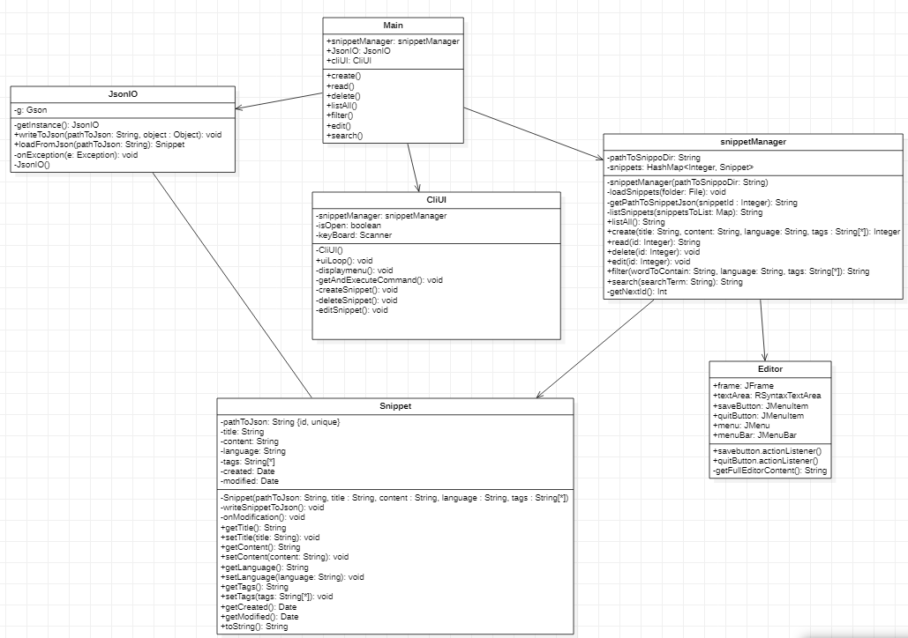

# Assignment 2

Maximum number of words for this document: 9000

**IMPORTANT**: In this assignment you will model the whole system. Within each of your models, you will have a *prescriptive intent* when representing the elements related to the feature you are implementing in this assignment, whereas the rest of the elements are used with a *descriptive intent*. In all your diagrams it is strongly suggested to used different colors for the prescriptive and descriptive parts of your models (this helps you in better reasoning on the level of detail needed in each part of the models and the instructors in knowing how to assess your models).   

**Format**: establish formatting conventions when describing your models in this document. For example, you style the name of each class in bold, whereas the attributes, operations, and associations as underlined text, objects are in italic, etc.

### Implemented feature

| ID  | Short name  | Description  |
|---|---|---|
| F12 | Basic interactive UI in shell | On launch the program shall display available commands (e.g. edit, create, delete) and execute the chosen ones until closed.  |
| F1.1| API to List All snippets | Users shall be able to list the data of all snippets (ID, title, language, tags) except for content |
| F1.2 | API to Create snippets | Users shall be able to edit snippets by calling the tool from the CLI using arguments. |
| F1.3 | API to Read a single snippet | Users shall be able to read full snippet data by calling the tool from the CLI using arguments. |
| F1.4 | API to Update snippets | Users shall be able to modify snippet content, title, language and tags by calling the tool from the CLI using arguments. |
| F1.5 | API to Delete snippets | Users shall be able to delete specific snippets by calling the tool from the CLI using arguments. |
| F2 | Snippet editor | Users shall be able to edit and save snippets via a basic Vim-like CLI editor with visual/insert/replace modes. |
| F3 | Tags | Users shall be able to add tags to snippets which will make snippets filterable by tag and finding snippets easier.|
| F5 | Filter | Users can filter for their snippets by content, tags, description, title, language. Like snippo -f "language:java tags:tag1,tag2 searchterm". |
| F6 | Configurable syntax highlighting | Users shall have their code for a specific language with highlighting of syntax that is configurable via a file (that they create or that has been provided) that maps keywords to colors. |
| F9 | Snippet metadata | Users shall be able to view snippet metadata such as creation and last modification date, count of times edited or opened. |
| F10 (optional) | Import/Export snippets | Users shall be able to import and export via a json file to reuse on a different machine using Snippo. |
| F12 | Basic interactive UI in shell | On launch the program shall display available commands (e.g. edit, create, delete) and execute the chosen ones until closed.  |

### Used modeling tool
StarUML http://staruml.io/

## Class diagram									
Author(s): Yael Goede

This chapter contains the specification of the UML class diagram of your system, together with a textual description of all its elements.

`Figure representing the UML class diagram`

### class: Snippet
This class represents the snippet objects, and thus contains the meta data and original data from the snippet.
#### Attributes
* _pathToJson_
    * this attribute makes the snippet unique, there for the content of the snippet can be retrieved separately. 
* _title_
    * the title attribute gives a quick summary of the contents of the snippet, this improves the usability and retrievability of the snippet.
* _content_
    * this is where the actual snippet code is stored.
* _language_
    * This attributes specifies the language the snippet utilises.
* _tags_
    * This attributes specifies the tags associated with the snippet. Tags are used to retrieve and manage snippets.
* _created_
    * This attribute contains the time/date the snippet was originally created.
* _modified_
    * This attribute will be update with the current time/date when the snippet is modified. 
#### Operations
* _Snippet(in pathToJson:String, in title :String, in content :String, in language :String, in tags :String[*])_
    * this is the constructor method of the snippet class
* _writeSnippetToJson(): void_
    * converts the snippet object into json format
* _onModification(): void_
    * updated the modification date field of the modified snippet
* _getTitle(): String_   
    * Returns the title of the current snippet.
* _setTitle(in title:String): void_
    * Set the title of the current snippet.
* _getContent(): String_
    * returns the content field of the current snippet object.
* _setContent(in content:String): void_
    * sets the content field of the current snippet object.
* _getLanguage(): String_
    * returns the language field
* _setLanguage(in language:String): void_
    *
* _getTags(): String_
    *
* _setTags(in tags:String[*]): void_
    *
* _getCreated(): Date_
    *
* _getModified(): Date_
    *
* _toString(): String_
    * Combines all the field of the snippet object into a readable String.
#### Associations
* _Snippet <-> JsonIO_
    * description
* _Snippet < snippetManager_
    *
### class: Editor
This class takes care of the editor part, meaning syntax highlighting and editing the snippet content. The editor class is in a directed relation, only with the snippetManager class.
#### Attributes
* _frame: JFrame_
    * description
* _textArea: RSyntaxTextArea_
    *
* _saveButton: JMenuItem_
    *
* _quitButton: JMenuItem_
    *
* _menu: JMenu_
    *
* _menuBar: JMenuBar_
    *
#### Operations
* _savebutton.actionListener()_
    * This method Listens for clicks on the savebutton and triggers the required actions onclick.
* _quitButton.actionListener()_
    *
* _getFullEditorContent(): String_
    * This operation returns all the content in the textarea field currently in the editor.
#### Associations
* _Editor < snippetManager_
    *

### class: CliUI
This class implements the UI, and thus controls the navigation within the menu and further actions with the program by the user.
#### Attributes
* _snippetManager: snippetManager_
    * contains the snippetManager object
* _isOpen: boolean_
    * Keeps track of the current state of the application.
* _keyBoard: Scanner_
    * Contains a scanner object for reading user input.
#### Operations
* _CliUI()_
    * Constructor function
* _uiLoop(): void_
    *
* _displaymenu(): void_
    *
* _getAndExecuteCommand(): void_
    *
* _createSnippet(): void_
    *
* _deleteSnippet(): void_
    *
* _editSnippet(): void_
    *
#### Associations
* _CliUI < Main_
    *   
 
### class: snippetManager
This class keeps track of all the snippets and is the only class able to modify the snippets.
#### Attributes
* _pathToSnippoDir: String_
    * Contains the path to the directory where all snippets are stored.
* _snippets: HashMap<Integer, Snippet>_
    * Keeps track of all snippets currently in the manager.
#### Operations
* _snippetManager(in pathToSnippoDir:String)_
    * Constructor function
* _loadSnippets(in folder:File): void_
    *
* _getPathToSnippetJson(in snippetId :Integer): String_
    *
* _listSnippets(in snippetsToList:Map): String_
    *
* _listAll(): String_
    *
* _create(in title:String, in content:String, in language:String, in tags :String[*]): Integer_
    *
* _read(in id:Integer): String_
    *
* _delete(in id:Integer): void_
    *
* _edit(in id:Integer): void_
    *
* _filter(in wordToContain:String, in language:String, in tags:String[*]): String_
    * 
* _search(in searchTerm:String): String_
    *
* _getNextId(): Int_
    *
#### Associations
* _snippetManager < Main_
    *  
* _snippetManager > Editor_
    *
* _snippetManager > Snippet_
    *

### class: JsonIO
This class takes care of the conversion between string type and Json type using the GSON library from google.
#### Attributes
* _g: Gson_
    * contains the Gson object
#### Operations
* _getInstance(): JsonIO_
    * Constructor function
* _writeToJson(in pathToJson:String, in object :Object): void_
    *
* _loadFromJson(in pathToJson:String): Snippet_
    *
* _onException(in e:Exception): void_
    *
* _JsonIO()_
    *
#### Associations
* _JsonIO < Main_
    *  
* _JsonIO > Snippet_
    *
    
For each class (and data type) in the class diagram you have to provide a paragraph providing the following information:
- Brief description about what it represents
- Brief description of the meaning of each attribute
- Brief description of the meaning of each operation
- Brief description of the meaning of each association involving it (each association can be described only once in this deliverable)

Also, you can briefly discuss fragments of previous versions of the class diagram (with figures) in order to show how you evolved from initial versions of the class diagram to the final one.

In this document you have to adhere to the following formatting conventions:
- the name of each **class** is in bold
- the *attributes*, *operations*, *associations*, and *objects* are in italic.

Maximum number of words for this section: 2500

## Object diagrams								
Author(s): Yael Goede

In the diagram above a snapshot of the system is shown where the database class is filled with 4 snippets. All snippets have a unique id which makes them unique from each other. Further more all fields are filled with the required information, such as the language, tags and content field. 
The content field contains the actual code used as snippet by the user. The language field specifies the programming language which is valid for the content field. This field enables features such as the text highlighting feature, which is language specific.

## State machine diagrams									
Author(s): `Björn Keyser`

This chapter contains the specification of at least 2 UML state machines of your system, together with a textual description of all their elements. Also, remember that classes the describe only data structures (e.g., Coordinate, Position) do not need to have an associated state machine since they can be seen as simple "data containers" without behaviour (they have only stateless objects).

### Class CLiUI
`Figure representing the UML state machine diagram for the CLiUI class`

`Textual description`
#### States
- Initial State: Here we display the menu and wait for the user input. In event of valid user input, one of the 6 functionalities is executed.
- View all snippets: Lists all snippets and their attributes (title, content, tags, language, metadata)
- Prompt for details [for creation of snippet]: In event of choosing to create a snippet, the user is prompted for a title, the language and tags. A snippet is then created and a editor is opened with no content. 
- Editor mode: The editor loads content if the editor opened a existing snippet, and a blank page otherwise. On exit, the user is prompted to either save the file or not.
- Prompt for ID: In case of deleting or editing a snippet, the user is prompted for the ID of the snippet to be deleted/edited. If the ID is valid the snippet is deleted/opened in the editor.
- View found snippets: In event of filtering, the user can specify parameters for filtering on title name, content or tags and the found snippets are displayed.
- Quit: quit the program								
Author(s): `name of the team member(s) responsible for this section`

This chapter contains the specification of at least 2 UML state machines of your system, together with a textual description of all their elements. Also, remember that classes the describe only data structures (e.g., Coordinate, Position) do not need to have an associated state machine since they can be seen as simple "data containers" without behaviour (they have only stateless objects).

For each state machine you have to provide:
- the name of the class for which you are representing the internal behavior;
- a figure representing the part of state machine;
- a textual description of all its states, transitions, activities, etc. in a narrative manner (you do not need to structure your description into tables in this case). We expect 3-4 lines of text for describing trivial or very simple state machines (e.g., those with one to three states), whereas you will provide longer descriptions (e.g., ~500 words) when describing more complex state machines.

The goal of your state machine diagrams is both descriptive and prescriptive, so put the needed level of detail here, finding the right trade-off between understandability of the models and their precision.

Maximum number of words for this section: 2500

## Sequence diagrams									
Author(s): Milos

This chapter contains the specification of at least 2 UML sequence diagrams of your system, together with a textual description of all its elements. Here you have to focus on specific situations you want to describe. For example, you can describe the interaction of player when performing a key part of the videogame, during a typical execution scenario, in a special case that may happen (e.g., an error situation), when finalizing a fantasy soccer game, etc.

For each sequence diagram you have to provide:
- a title representing the specific situation you want to describe;
- a figure representing the sequence diagram;
- a textual description of all its elements in a narrative manner (you do not need to structure your description into tables in this case). We expect a detailed description of all the interaction partners, their exchanged messages, and the fragments of interaction where they are involved. For each sequence diagram we expect a description of about 300-500 words.

The goal of your sequence diagrams is both descriptive and prescriptive, so put the needed level of detail here, finding the right trade-off between understandability of the models and their precision.

Maximum number of words for this section: 2500

## Implementation									
Author(s): `name of the team member(s) responsible for this section`

In this chapter you will describe the following aspects of your project:
- the strategy that you followed when moving from the UML models to the implementation code;
- the key solutions that you applied when implementing your system (for example, how you implemented the syntax highlighting feature of your code snippet manager, how you manage fantasy soccer matches, etc.);
- the location of the main Java class needed for executing your system in your source code;
- the location of the Jar file for directly executing your system;
- the 30-seconds video showing the execution of your system (you can embed the video directly in your md file on GitHub).

### Strategy
To make sure our implementation is consistent with the presented uml diagrams, we iteratively implemented the features, classes and quality requirements. By using the agile development method our team could track open tasks through the scrumboard available on the github platform.

### Key Solution
To keep us from reinventing the wheel, our implementation tries to use as many external libraries as possible. For example, our dynamic text highlighting feature is implemented using an external syntaxhighlighting library.

### location of the main Java class
_src/main/java/Main.java_

### Location of the Jar file

### 30-second video

IMPORTANT: remember that your implementation must be consistent with your UML models. Also, your implementation must run without the need from any other external software or tool. Failing to meet this requirement means 0 points for the implementation part of your project.

Maximum number of words for this section: 1000

## References

References, if needed.
