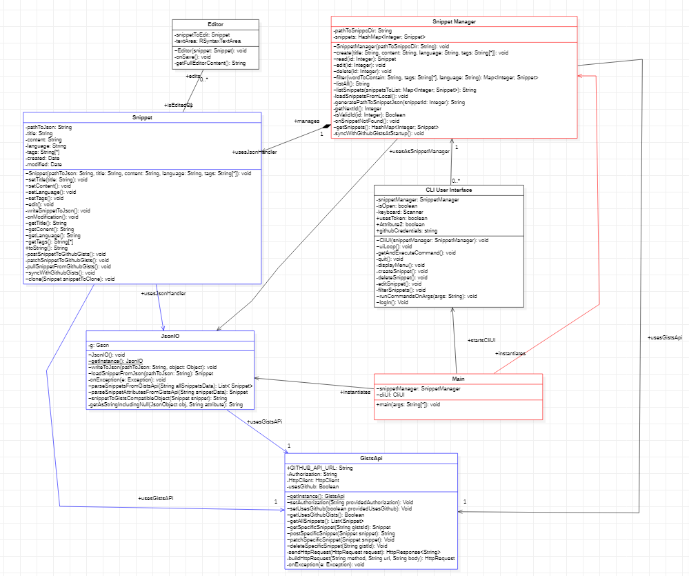
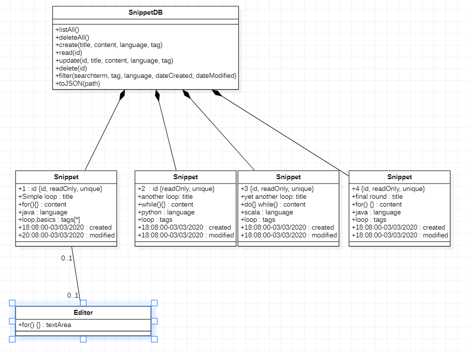
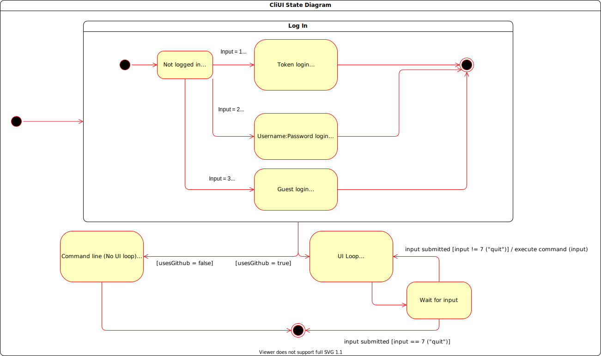
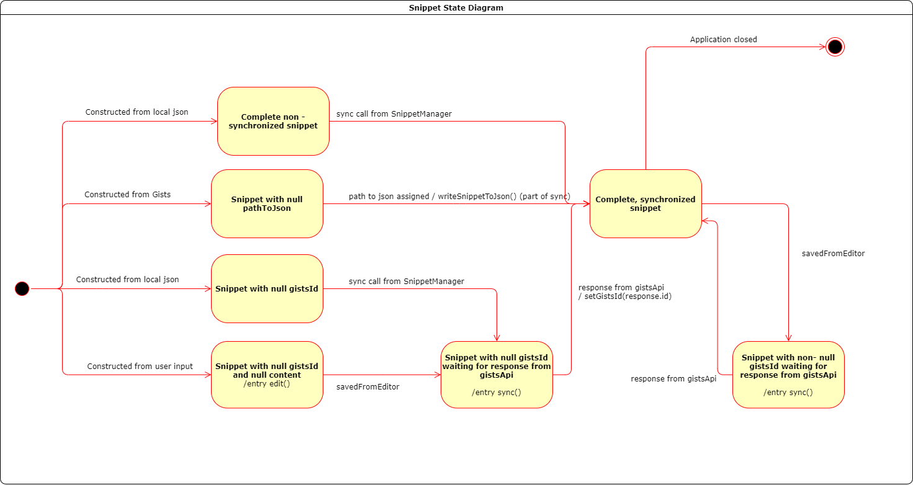
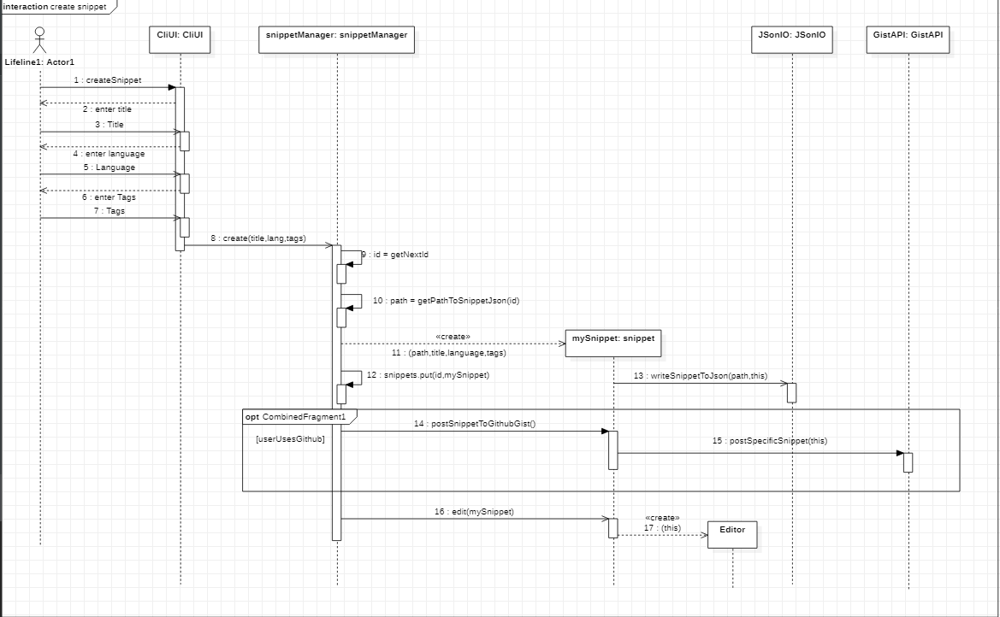
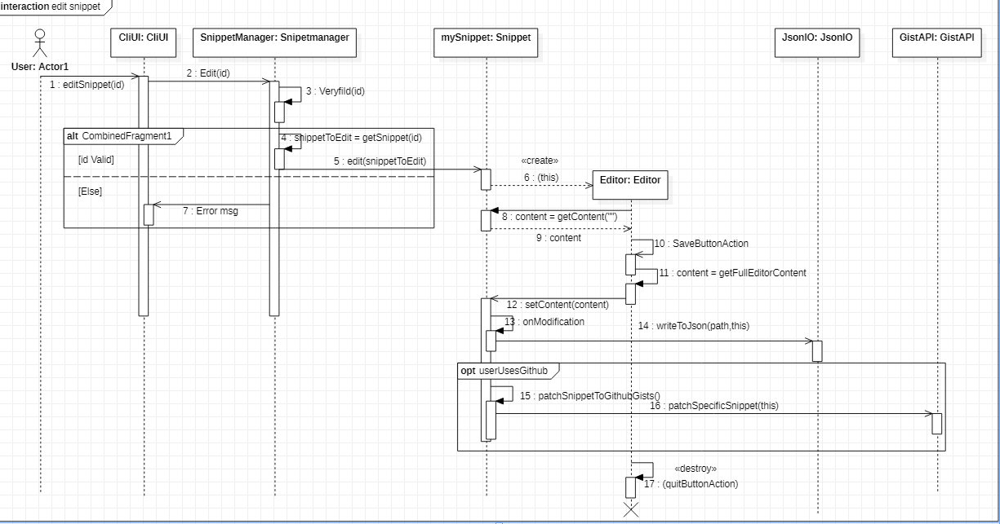
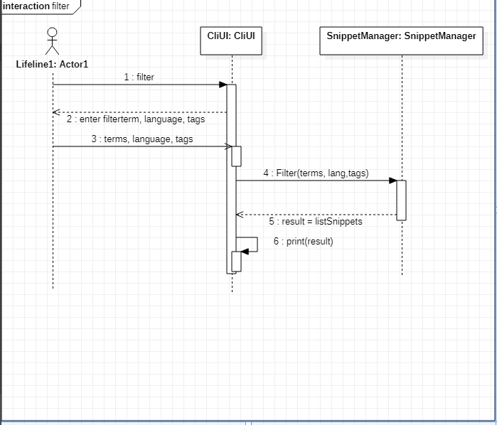

# Assignment 3

### Summary of changes of Assignment 2
Author(s): Milos

- Object diagram now represents classes that actually exist within our application.
- Removed compositions from our object diagram.
- Added proper syntax to show class instances in object diagram.
- Properly adjusted the Multiplicity in our class diagram.
- Created proper state machine diagrams.
- F1 in our features now only has the split ones.
- Adjusted the variable name “g” to “gson” in our JsonIO class for better readability.
- Our CliUI no longer crashes when user inputs an invalid character.

### Application of design patterns
Author(s): Yael Goede

| ID  | DP1  | DP1 | DP2 |
|---|---| --- | --- | 
| **Design pattern** | Singleton Design | Object pool Pattern |
| **Problem** | Some classed in our application should only have one access point to it to ensure its intended use | To optimise for efficiency the application needs to be efficient with expensive resources |
| **Solution**  | This design pattern ensures that a class has only one instance and provides a global point of access to it | This design pattern ensures that the application reuses objects that are expensive to create, end therefore optimises for efficiency for available resources |
| **Intended use**   We will be using this design pattern to ensure our stored data will be accessed and read in a save and correct way by offering a single point of access which we can design and thus control | The main application of this design pattern will be to optimise the use of snippets in our system, creating a lifecycle to minimise disk usage |
| **Constraints**  | Our solution is also our constraint sinds a big part of our application is now dependend on this pattern to access information. Dependency wise, this is not ideal | * |
| **Additional remarks**  | * | * |

## Class diagram									
Author(s): `Yael Goede`, `Serghei Mihailov`

### class: Snippet
This class represents the snippet objects, and thus contains the meta data and original data from the snippet.

#### Attributes
* _pathToJson_
    * this attribute makes the snippet unique, there for the content of the snippet can be retrieved separately. 
* _title_
    * the title attribute gives a quick summary of the contents of the snippet, this improves the usability and retrievability of the snippet.
* _content_
    * this is where the actual snippet code is stored.
* _gistId_
    * the Id for the snippet on gist.
* _language_
    * This attributes specifies the language the snippet utilises.
* _tags_
    * This attributes specifies the tags associated with the snippet. Tags are used to retrieve and manage snippets.
* _created_
    * This attribute contains the time/date the snippet was originally created.
* _modified_
    * This attribute will be update with the current time/date when the snippet is modified. 
#### Operations
* _Snippet(in pathToJson:String, in title :String, in content :String, in language :String, in tags :String[*])_
    * this is the constructor method of the snippet class
* _writeSnippetToJson(): void_
    * converts the snippet object into json format
* _onModification(): void_
    * updated the modification date field of the modified snippet
* _edit(): void_
    * opens an editor of the snippet that allows to modify its content.
* _getTitle(): String_   
    * Returns the title of the current snippet.
* _setTitle(in title:String): void_
    * Set the title of the current snippet.
* _getContent(): String_
    * returns the content field of the current snippet object.
* _setContent(in content:String): void_
    * sets the content field of the current snippet object.
* _getLanguage(): String_
    * returns the language field
* _setLanguage(in language:String): void_
    * just sets the language attribute to a value
* _getTags(): String[*]_
    * returns the tag String array
* _setTags(in tags:String[*]): void_
    * just sets the tags attribute to a value
* _getCreated(): Date_
    * returns creation date
* _getModified(): Date_
    * returns last modification date
* _toString(): String_
    * Combines all the field of the snippet object into a readable String.
* _clone(Snippet snippetToClone): void_
    * a helper function for the parser that parses gist objects to our snippet objects
* _syncWithGithubGists(): void_
    * will post a locally created snippet to gist if its not there already.
* _postSnippetToGithubGists(): void_
    * will post a snippet to github gist
* _patchSnippetToGithubGists(): void_
    * will patch/update a snippet on github gist
* _pullSnippetFromGithubGists(): void_
    * will retrieve a snippet from github gist
* _getGistsId(): String_
    * getter function for the id for the gists in github
  
  
#### Associations
* _Snippet > JsonIO_
    * described
* _Snippet - Editor_
    * The snippet instantiates the editor to edit its contents.
### class: Editor
This class takes care of the editor part, meaning syntax highlighting and editing the snippet content. The editor class is in a directed relation, only with the snippetManager class.
#### Attributes
* _textArea: RSyntaxTextArea_
    * the input text field that stores users modifications to the content of the snippet and provides syntax highlighting.
* _snippetToEdit: Snippet_
    * the snippet edited.
#### Operations
* _Editor(snippet:Snippet): void_
    * Initializes all the UI elements (frame, menu, textarea, listeners) and launches the editor window.
* _onSave(): void_
    * on a save event (e.g. user presses the Save menu item) this sets the content of the edited snippet to the content of the text area.
* _getFullEditorContent(): String_
    * This operation returns all the content in the textarea field currently in the editor.
#### Associations
* _Snippet - Editor_
    * described in Snippet.
### class: CliUI
This class implements the UI, and thus controls the navigation within the menu and further actions with the program by the user.
#### Attributes
* _snippetManager: snippetManager_
    * contains the snippetManager object that the user interacts with. 
* _isOpen: boolean_
    * Keeps track of the current state of the application.
* _keyBoard: Scanner_
    * Contains a scanner object for reading user input.
#### Operations
* _CliUI(in snippetManager:SnippetManager): CliUI_
    * Constructor function
* _uiLoop(): void_
    * Will display the menu and execute entered commands until the user quits.
* _displayMenu(): void_
    * Simply displays hardcoded menu options.
* _getAndExecuteCommand(): void_
    * Reads keyboard input and executes the corresponding command (as per the menu). 
* _createSnippet(): void_
    * the method makes all the necessary client-side operations to create a snippet, like prompting for input and making calls to backend.
* _deleteSnippet(): void_
    * same as create but delete.
* _editSnippet(): void_
    * same as create but edit.
* _filterSnippets(): void_
    * same as create but filter. Also prints the output of the snippets that match the filter.
* _quit(): void_
    * stops the ui loop by setting the loop variable `isOpen` to `false`.
* _runCommandsOnArgs(in args:String): void_
    * this parses the command line arguments if there are any and executes the respective command, displaying the output, then the app finishes.
    
#### Associations
* _CliUI < Main_
    * The Cli class is called from main and handles all the user interactions with the program.
* _CliUI > SnippetManager_
    * The Cli is initialized using a specific snippet manager as backend. 0..* Clis can use 1 snippet manager, but only one snippet manager per Cli.

### class: snippetManager
This class keeps track of all the snippets and is the only class able to modify the snippets.
#### Attributes
* _pathToSnippoDir: String_
    * Contains the path to the directory where all snippets are stored.
* _snippets: HashMap<Integer, Snippet>_
    * Keeps track of all snippets currently in the manager.
#### Operations
* _SnippetManager(pathToSnippoDir:String): void_
    * Constructor function
* _loadSnippets(folder:File): void_
    * uses JsonIO to read all snippets in the `pathToSnippoDir` folder.
* _listSnippets(snippetsToList:Map<Integer, Snippet>): String_
    * given an integer-snippet map, prints the list of snippets.
* _listAll(): String_
    * same as listSnippets but for all snippets managed.
* _create(title:String, content:String, language:String, tags :String[*]): Integer_
    * creates a snippet object with the given arguments.
* _read(id:Integer): Snippet_
    * returns the snippet with the provided id.
* _delete(id:Integer): void_
    * deletes the snippet with the provided id.
* _edit(id:Integer): void_
    * calls the snippets edit method.
* _filter(wordToContain:String, tags:String[*], language:String): HashMap<Integer, Snippet>_
    * filters the snippets managed and returns an integer-snippet map.
* _getNextId(): Int_
    * gets the next available id for a new snippet.
* _isValidId(id:Integer): Boolean_
    * checks if an integer is a valid id for an existing snippet.
* _generatePathToSnippetJson(snippetId:Integer): String_
    * returns the relative path for the requested snippet (by id).
* _getSnippets(): HashMap<Integer; Snippet>_
    * returns all the managed snippets as an integer-snippet hashmap.
* _loadSnippetsFromLocal(): void_
     *Load all the snippets on the users local machine.
* _syncWithGithubGistsAtStartup(): void_
     * This function makes sure that on startup, the locally saved snippet and gist saved snippets match. It will first get the local snippets, and then the ones saved on gist. If 2 instances of a snippet are different, it will pick the one that is updated the most recent.
 
#### Associations
* _SnippetManager < Main_
    *  On the start of the program the main class constructs a snippetmanager class which maintains all the operations on the snippets.
* _SnippetManager > Snippet_
    * described
* _SnippetManager > JsonIO_
    * described
    
### class: JsonIO
This class takes care of the conversion between string type and Json type using the GSON library.
#### Attributes
* _g: Gson_
    * contains the Gson object
#### Operations
* _JsonIO(): void_
    * instantiatest a Gson object.
* _getInstance(): JsonIO_
    * returns the singleton json object.
* _writeToJson(pathToJson:String, object :Object): void_
    * serializes an object.
* _loadFromJson(pathToJson:String): Snippet_
    * deserializes a Snippet.
* _onException(e:Exception): void_
    * handles exceptions like file not found or bad data.
* _parseSnippetsFromGistsApi(String allSnippetsData): List<Snippet>_
    * Function responsible for parsing the gists from github to our snippet format
* _parseSnippetAttributesFromGistsApi(String snippetData): Snippet_
    * 
* _snippetToGistsCompatibleObject(Snippet snippet): String_
    * responsible for parsing a gist snippet to our own snippet object
* _getAsStringIncludingNull(JsonObject obj, String attribute): String_
    * transforms objects into a string, a helper function for the parser.
#### Associations
* _JsonIO < Main_
    * already described
* _JsonIO < Snippet_
    * The snippet class uses the JsonIO class to convert snippet objects to json, to store snippet objects.
* _JsonIO < SnippetManager_
    * The snippet manager class uses the JsonIO class to convert json to objects, to retrieve snippet objects.

### class: Main
 
#### Attributes
* _snippetManager: SnippetManager_
    * the snippet manager used by the current instance of the app.
* _cliUI: CliUI_
    * the cliUI used by the current instance of the app.
#### Operations
* _main(args:String[*]): void_
    * Instantiates SnippetManager, CliUI and JsonIO. After this, CliUI handles the flow of the app.
#### Associations
* _Main > JsonIO_
    * instantiates.
* _Main > SnippetManager_
    * instantiates.
* _Main > CliUI_
    * instantiates.

### class: GistsApi

This class is responsible for the integration of Githubs Gists with our application
#### Attributes
* _httpClient: String: HttpClient_
    * HttpClient object.
* _authorization: string_
    * authorization token that github uses.
* _usesGithub: boolean_
    * boolean that shows wether the user has linked his github or not.
#### Operations
* _SnippetManager(pathToSnippoDir:String): void_
    * Constructor function
* _getInstance(): GistsApi_
    * returns instance of the GistsApi singleton.
* _setAuthorization(String providedAuthorization): Void_
    * set the authorization token to the one the users has provided on login.
* _setUsesGithub(boolean providedUsesGithub): Void_
    * boolean that shows wether or not the user is using github gists integration
* _getUsesGithubGists(): Boolean_
    * getter function for the usesGithub variable
* _getAllSnippets(): List<Snippet>_
    * returns all the gists and parses them to match our snippets
* _getSpecificSnippet(String gistsId): Snippet_
    * returns a specific gist with passed gistId
* _postSpecificSnippet(Snippet snippet): String_
    * posts a snippet to gist
* _patchSpecificSnippet(Snippet snippet): Void_
    * updates a specific snippet to gist
* _deleteSpecificSnippet(String gistId): Void_
    * deletes a specific snippet from gist
* _sendHttpRequest(HttpRequest request):HttpResponse<String>
    * send a http request, used to send the request to the Gists api.
* _buildHttpRequest(String method, String url, String body): HttpRequest_
    * build a http request, used to build the reqeusts we send to the Gists api
* _onException(Exception e): Void_
    * handles errors.
#### Associations
* GistsApi > SnippetManager 
    *  provides api.
* GistsApi > snippet
    * provides api.
* GistsApi > JSonIo
    * provides api.
## Object diagrams								
Author(s): Yael Goede

In the diagram above a snapshot of the system is shown where the database class is filled with 4 snippets. All snippets have a unique id which makes them unique from each other. Further more all fields are filled with the required information, such as the language, tags and content field. 
The content field contains the actual code used as snippet by the user. The language field specifies the programming language which is valid for the content field. This field enables features such as the text highlighting feature, which is language specific.

## State machine diagrams									
Author(s): `Serghei`

This chapter contains the specification of at least 2 UML state machines of your system, together with a textual description of all their elements. Also, remember that classes the describe only data structures (e.g., Coordinate, Position) do not need to have an associated state machine since they can be seen as simple "data containers" without behaviour (they have only stateless objects).

For each state machine you have to provide:
- the name of the class for which you are representing the internal behavior;
- a figure representing the part of state machine;
- a textual description of all its states, transitions, activities, etc. in a narrative manner (you do not need to structure your description into tables in this case). We expect 3-4 lines of text for describing trivial or very simple state machines (e.g., those with one to three states), whereas you will provide longer descriptions (e.g., ~500 words) when describing more complex state machines.

The goal of your state machine diagrams is both descriptive and prescriptive, so put the needed level of detail here, finding the right trade-off between understandability of the models and their precision.

Maximum number of words for this section: 4000

- Class: CliUI
- CliUI is the entry point of the application. It provides an user interface to the functionality of the program and is concerned with getting all of the user input except for the editor window and gists data. Moreover, CliUI also contains the logging in functionality (because it is too simple to have a class on its own). At the start of the app, the CliUI asks the user if the user would like to authorize and, if yes, in which way: by using their Github access token or Basic auth. Then, depending on the option selected, CliUI will set the relevant static variables as necessary and proceed. If the app was called using command-line arguments, it will execute the respective command and exit. Otherwise (the more common use case), the UI loop will start: dispay menu, get command, execute command, repeat until the command is QUIT.

---

- Class: Snippet
- The Snippet class contains most of the data of the application. Its main role, once instantiated, is to allow simple data manipulation, such as setting content, tags, title, and synchronization. We that it would be ideal to let the snippet handle its own synchronization. 
- The snippet starts off being incomplete, in one of 4 states: 
    1. loaded from local json and already having gistsId (previously synced)
    2. loaded from Gists and thus not being on local (otherwise it would've been in the state above)
    3. loaded from local json but not having gistsId (never synced with Gists)
    4. created from the user interface and not yet having gistsId or content (because the user is editing the content)
- A snippet from state 1 just gets synced on startup, after a call from the Snippet Manager.
- A snippet from state 2 has just been obtained from the API response but does not have a local file yet. It is assigned one by the SnippetManager and the data is written to local json.
- Snippets in state 3 and 4 need to sync with Gists, so a POST request to Gists is made and the response contains their Gists id. 
- After all this, each snippet becomes complete (in terms of data) and synchronized.
- It can make a state transition if it is edited, thus becoming temporarily out of sync. Then it transitions back into the previous state.

## Sequence diagrams									
Author(s): Milos Delgorge
### Sequence diagram for Creating a snippet

### Description
The user selects create in the Command line interface. After selecting create, the user is prompted 
with 3 reply messages asking for the title, language and tags for the snippet the user wants to create. 
After the user provides this information, the Command line interface calls create() to the snippet 
manager, which will fist call a method called getNextId, which will return the next available
ID the snippet can have. After it has the ID, the snippet manager creates a new instance of a snippet with that ID and the information specified by the user. When a new snippet is constructed, a new file is made and the snippet calls writeSnippetToJson, which is part of the JsonIO class. 
This will write the relevant data for the snippet to the file.
The snippet objects are stored in a hashmap called snippets. 
After a new snippet object is created, the snippet manager adds a new entry to the hashmap, 
containing the ID and created snippet. If the user has linked up his github gists with our application, the snippetmanager will call a method postSnippetToGithubGist to the created snippet, which will then in turn make a call to postSnippet to the GistAPI class, which will create a gist. If the user has not linked his github, these steps will not be taken.  
After this is done, the snippet manager will call edit on that snippet, and the user will be able to start writing the contents for their newly created snippet.

### Sequence diagram for Editing a snippet

### Description
When the user choses the edit snippet option from the Command line interface and provided the ID of the snippet he/she wants to edit back to the Cli, the Cli makes a call Edit to the snippet manager class. fist the snippet manager will check if the ID the user provided is valid. If the ID is not valid, an error message will be prompted to the user through the Command line interface. If the ID is valid, the snippet manager will send a message to the snippet that is about to be edited, Edit(snippetToEdit). The snippet will then open an editor. When this instance of the editor
class is constructed, it will grab the content from the snippet the user has selected to edit by calling getContent on the snippet and will display that in the textfield. Now that the editor is open the user can freely edit the contents of the snippet. When the user has edited his/hers snippet and wishes to close 
out of the editor and presses save, the method setContent is called on the snippet
object that’s currently being edited. This method is responsible for updating the Json snippet’s content. The argument passed to this method is getFullEditorContent, which returns the current content in the editor. When setContent is called on the snippet object, the snippet calls the method writeToJson, which is part of the JsonIO class. This method updates the Json object so that the changes are actually saved. When write to Json is called, a method onModification is called within the snippet, which has a check wether or not the user has linked gist with our application, if this is the case, the snippet will call a method patchSnippetToGisthubGist, which will call the method patchSpecificSnippet to the GistAPI singleton class, which will then update the gist version of our snippet with the content it currently has saved locally on the users machine so its properly synched up. This JsonIO class is a singleton class that is nice to have, because then the snippet manager doesn’t have to be responsible for saving snippets, but the snippets can “save themselves” by using that helper class, which is good for modularity, and will make changing specific details in the way snippets are saved/stored easier to do because of the fact there are less dependencies between classes.

### Sequence diagram for the filter method

### Description						
The user selects the filter option in the Command line interface. 
The Cli will return a message asking the user to specify filterterms, language, and tags to filter by.
After the user has provided these arguments to the Cli, the Cli then calls Filter() with those parameters to the snippet manager. Filter will return a string object that contains snippets. 
This string is constructed by the listSnippet method. listSnippet will return all snippets in string form, but with the filter method we reduce that to only the snippets that conform to the filter specified by the user. 
This string will be provided back to the Cli, which then prints that string for the user to see.	

This chapter contains the specification of at least 2 UML sequence diagrams of your system, together with a textual description of all its elements. Here you have to focus on specific situations you want to describe. For example, you can describe the interaction of player when performing a key part of the videogame, during a typical execution scenario, in a special case that may happen (e.g., an error situation), when finalizing a fantasy soccer game, etc.

For each sequence diagram you have to provide:
- a title representing the specific situation you want to describe;
- a figure representing the sequence diagram;
- a textual description of all its elements in a narrative manner (you do not need to structure your description into tables in this case). We expect a detailed description of all the interaction partners, their exchanged messages, and the fragments of interaction where they are involved. For each sequence diagram we expect a description of about 300-500 words.

The goal of your sequence diagrams is both descriptive and prescriptive, so put the needed level of detail here, finding the right trade-off between understandability of the models and their precision.

Maximum number of words for this section: 4000

## Implementation									
Author(s): `Serghei`, `Milos`

### Strategy
* To make sure our implementation is consistent with the presented uml diagrams, we iteratively implemented the features, classes and quality requirements. By using the agile development method our team could track open tasks through the scrumboard available on the github projects platform.
* Timeline:
    * Week 1 (17.02-23.02): Brainstorm the application. We went back and forth discussing requirements and implementation. Sketch the first class and sequence diagram. First class diagram: CliUI -> Snippet Manager -> Snippet -> Editor. (include pic)
	* Week 2 (24.02-01.03): Minimum functional app including all the classes described in the class model and the main features (CRUD, basic CLI UI, filtering, snippet persistence using json and import/export). As we were developing the app it became easier to see the structural dependencies between classes and to adjust our class diagram as well as add new relevant classes (like the singleton JsonIO for managing json read/write). We also adjusted the sequence diagrams to better model the calls made between the classes as they grew in complexity.
	* Week 3 (02.03-08.03): We spent this week adjusting our code to the revisited class and sequence models and to properly place the complexity inside the right classes. For instance we made the editor to only interface with the Snippet class and removed its usages inside the SnippetManager class. This way we removed an unnecessary responsibility from the SnippetManager and decreased the complexity of the project. Moreover, we added new features and polished the existing ones. The editor was implemented and allowed for a simpler modification of snippets with syntax highlighting. Instead of saving all snippets in one json file, the app now uses a directory with one file per snippet, which made export and import easier. Finally, we created the state machine and the object diagrams to describe the behavior of our app.
    * Week 4 (9.03-15.03):  We used this week to adress feedback from assignment 2, adjust our diagrams according to that feedback, and plan the next steps for our application
    * Week 5 (16.03-22.03): worked on integrating github Gist api with our application and implementing the search functionality.
    * week 6 (23.03-29.03): We adjusted our diagrams according to the finalized code of our application.
### Key Solution
There were two key solutions that made developing the app easier: `org.fife.ui.rsyntaxtextarea` library for syntax highlighting and `com.google.gson.Gson` for serializing and deserializing snippets. They provided a lot of utility while saving development time and reducing the complexity of the project. If we were to write our own syntax highlighting engine, it would have taken us enormous effort to come up with the requirements and an implementation, let alone collecting all the necessary data about syntax of programming languages. The same applies to Gson.

### location of the main Java class
_src/main/java/Main.java_

### Location of the Jar file
_out/artifacts/software_design_vu_2020_jar/software-design-vu-2020.jar_
### 30-second video
Click the image below to view the video

