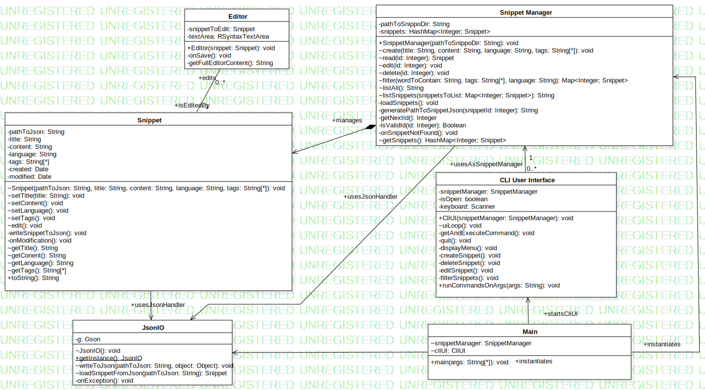

# Assignment 3

Maximum number of words for this document: 18000

**IMPORTANT**: In this assignment you will fully model and impement your system. The idea is that you improve your UML models and Java implementation by (i) applying (a subset of) the studied design patterns and (ii) adding any relevant implementation-specific details (e.g., classes with “technical purposes” which are not part of the domain of the system). The goal here is to improve the system in terms of maintainability, readability, evolvability, etc.    

**Format**: establish formatting conventions when describing your models in this document. For example, you style the name of each class in bold, whereas the attributes, operations, and associations as underlined text, objects are in italic, etc.

### Summary of changes of Assignment 2
Author(s): `name of the team member(s) responsible for this section`

Provide a bullet list summarizing all the changes you performed in Assignment 2 for addressing our feedback.

Maximum number of words for this section: 1000

### Application of design patterns
Author(s): `name of the team member(s) responsible for this section`

`Figure representing the UML class diagram in which all the applied design patterns are highlighted graphically (for example with a red rectangle/circle with a reference to the ID of the applied design pattern`

For each application of any design pattern you have to provide a table conforming to the template below.

| ID  | DP1  |
|---|---|
| **Design pattern**  | Name of the applied pattern |
| **Problem**  | A paragraph describing the problem you want to solve |
| **Solution**  | A paragraph describing why with the application of the design pattern you solve the identified problem |
| **Intended use**  | A paragraph describing how you intend to use at run-time the objects involved in the applied design patterns (you can refer to small sequence diagrams here if you want to detail how the involved parties interact at run-time |
| **Constraints**  | Any additional constraints that the application of the design pattern is imposing, if any |
| **Additional remarks**  | Optional, only if needed |

Maximum number of words for this section: 2000

## Class diagram									
Author(s): `Yael Goede`, `Serghei Mihailov`

### class: Snippet
This class represents the snippet objects, and thus contains the meta data and original data from the snippet.

#### Attributes
* _pathToJson_
    * this attribute makes the snippet unique, there for the content of the snippet can be retrieved separately. 
* _title_
    * the title attribute gives a quick summary of the contents of the snippet, this improves the usability and retrievability of the snippet.
* _content_
    * this is where the actual snippet code is stored.
* _language_
    * This attributes specifies the language the snippet utilises.
* _tags_
    * This attributes specifies the tags associated with the snippet. Tags are used to retrieve and manage snippets.
* _created_
    * This attribute contains the time/date the snippet was originally created.
* _modified_
    * This attribute will be update with the current time/date when the snippet is modified. 
#### Operations
* _Snippet(in pathToJson:String, in title :String, in content :String, in language :String, in tags :String[*])_
    * this is the constructor method of the snippet class
* _writeSnippetToJson(): void_
    * converts the snippet object into json format
* _onModification(): void_
    * updated the modification date field of the modified snippet
* _edit(): void_
    * opens an editor of the snippet that allows to modify its content.
* _getTitle(): String_   
    * Returns the title of the current snippet.
* _setTitle(in title:String): void_
    * Set the title of the current snippet.
* _getContent(): String_
    * returns the content field of the current snippet object.
* _setContent(in content:String): void_
    * sets the content field of the current snippet object.
* _getLanguage(): String_
    * returns the language field
* _setLanguage(in language:String): void_
    * just sets the language attribute to a value
* _getTags(): String[*]_
    * returns the tag String array
* _setTags(in tags:String[*]): void_
    * just sets the tags attribute to a value
* _getCreated(): Date_
    * returns creation date
* _getModified(): Date_
    * returns last modification date
* _toString(): String_
    * Combines all the field of the snippet object into a readable String.
#### Associations
* _Snippet > JsonIO_
    * described
* _Snippet - Editor_
    * The snippet instantiates the editor to edit its contents.
### class: Editor
This class takes care of the editor part, meaning syntax highlighting and editing the snippet content. The editor class is in a directed relation, only with the snippetManager class.
#### Attributes
* _textArea: RSyntaxTextArea_
    * the input text field that stores users modifications to the content of the snippet and provides syntax highlighting.
* _snippetToEdit: Snippet_
    * the snippet edited.
#### Operations
* _Editor(snippet:Snippet): void_
    * Initializes all the UI elements (frame, menu, textarea, listeners) and launches the editor window.
* _onSave(): void_
    * on a save event (e.g. user presses the Save menu item) this sets the content of the edited snippet to the content of the text area.
* _getFullEditorContent(): String_
    * This operation returns all the content in the textarea field currently in the editor.
#### Associations
* _Snippet - Editor_
    * described in Snippet.
### class: CliUI
This class implements the UI, and thus controls the navigation within the menu and further actions with the program by the user.
#### Attributes
* _snippetManager: snippetManager_
    * contains the snippetManager object that the user interacts with. 
* _isOpen: boolean_
    * Keeps track of the current state of the application.
* _keyBoard: Scanner_
    * Contains a scanner object for reading user input.
#### Operations
* _CliUI(in snippetManager:SnippetManager): CliUI_
    * Constructor function
* _uiLoop(): void_
    * Will display the menu and execute entered commands until the user quits.
* _displayMenu(): void_
    * Simply displays hardcoded menu options.
* _getAndExecuteCommand(): void_
    * Reads keyboard input and executes the corresponding command (as per the menu). 
* _createSnippet(): void_
    * the method makes all the necessary client-side operations to create a snippet, like prompting for input and making calls to backend.
* _deleteSnippet(): void_
    * same as create but delete.
* _editSnippet(): void_
    * same as create but edit.
* _filterSnippets(): void_
    * same as create but filter. Also prints the output of the snippets that match the filter.
* _quit(): void_
    * stops the ui loop by setting the loop variable `isOpen` to `false`.
* _runCommandsOnArgs(in args:String): void_
    * this parses the command line arguments if there are any and executes the respective command, displaying the output, then the app finishes.
    
#### Associations
* _CliUI < Main_
    * The Cli class is called from main and handles all the user interactions with the program.
* _CliUI > SnippetManager_
    * The Cli is initialized using a specific snippet manager as backend. 0..* Clis can use 1 snippet manager, but only one snippet manager per Cli.

### class: snippetManager
This class keeps track of all the snippets and is the only class able to modify the snippets.
#### Attributes
* _pathToSnippoDir: String_
    * Contains the path to the directory where all snippets are stored.
* _snippets: HashMap<Integer, Snippet>_
    * Keeps track of all snippets currently in the manager.
#### Operations
* _SnippetManager(pathToSnippoDir:String): void_
    * Constructor function
* _loadSnippets(folder:File): void_
    * uses JsonIO to read all snippets in the `pathToSnippoDir` folder.
* _listSnippets(snippetsToList:Map<Integer, Snippet>): String_
    * given an integer-snippet map, prints the list of snippets.
* _listAll(): String_
    * same as listSnippets but for all snippets managed.
* _create(title:String, content:String, language:String, tags :String[*]): Integer_
    * creates a snippet object with the given arguments.
* _read(id:Integer): Snippet_
    * returns the snippet with the provided id.
* _delete(id:Integer): void_
    * deletes the snippet with the provided id.
* _edit(id:Integer): void_
    * calls the snippets edit method.
* _filter(wordToContain:String, tags:String[*], language:String): HashMap<Integer, Snippet>_
    * filters the snippets managed and returns an integer-snippet map.
* _getNextId(): Int_
    * gets the next available id for a new snippet.
* _isValidId(id:Integer): Boolean_
    * checks if an integer is a valid id for an existing snippet.
* _generatePathToSnippetJson(snippetId:Integer): String_
    * returns the relative path for the requested snippet (by id).
* _getSnippets(): HashMap<Integer; Snippet>_
    * returns all the managed snippets as an integer-snippet hashmap.
#### Associations
* _SnippetManager < Main_
    *  On the start of the program the main class constructs a snippetmanager class which maintains all the operations on the snippets.
* _SnippetManager > Snippet_
    * described
* _SnippetManager > JsonIO_
    * described
    
### class: JsonIO
This class takes care of the conversion between string type and Json type using the GSON library.
#### Attributes
* _g: Gson_
    * contains the Gson object
#### Operations
* _JsonIO(): void_
    * instantiatest a Gson object.
* _getInstance(): JsonIO_
    * returns the singleton json object.
* _writeToJson(pathToJson:String, object :Object): void_
    * serializes an object.
* _loadFromJson(pathToJson:String): Snippet_
    * deserializes a Snippet.
* _onException(e:Exception): void_
    * handles exceptions like file not found or bad data.
#### Associations
* _JsonIO < Main_
    * already described
* _JsonIO < Snippet_
    * The snippet class uses the JsonIO class to convert snippet objects to json, to store snippet objects.
* _JsonIO < SnippetManager_
    * The snippet manager class uses the JsonIO class to convert json to objects, to retrieve snippet objects.

### class: Main
 
#### Attributes
* _snippetManager: SnippetManager_
    * the snippet manager used by the current instance of the app.
* _cliUI: CliUI_
    * the cliUI used by the current instance of the app.
#### Operations
* _main(args:String[*]): void_
    * Instantiates SnippetManager, CliUI and JsonIO. After this, CliUI handles the flow of the app.
#### Associations
* _Main > JsonIO_
    * instantiates.
* _Main > SnippetManager_
    * instantiates.
* _Main > CliUI_
    * instantiates.
    
## Object diagrams								
Author(s): Yael Goede

In the diagram above a snapshot of the system is shown where the database class is filled with 4 snippets. All snippets have a unique id which makes them unique from each other. Further more all fields are filled with the required information, such as the language, tags and content field. 
The content field contains the actual code used as snippet by the user. The language field specifies the programming language which is valid for the content field. This field enables features such as the text highlighting feature, which is language specific.

## State machine diagrams									
Author(s): `name of the team member(s) responsible for this section`

This chapter contains the specification of at least 2 UML state machines of your system, together with a textual description of all their elements. Also, remember that classes the describe only data structures (e.g., Coordinate, Position) do not need to have an associated state machine since they can be seen as simple "data containers" without behaviour (they have only stateless objects).

For each state machine you have to provide:
- the name of the class for which you are representing the internal behavior;
- a figure representing the part of state machine;
- a textual description of all its states, transitions, activities, etc. in a narrative manner (you do not need to structure your description into tables in this case). We expect 3-4 lines of text for describing trivial or very simple state machines (e.g., those with one to three states), whereas you will provide longer descriptions (e.g., ~500 words) when describing more complex state machines.

The goal of your state machine diagrams is both descriptive and prescriptive, so put the needed level of detail here, finding the right trade-off between understandability of the models and their precision.

Maximum number of words for this section: 4000

## Sequence diagrams									
Author(s): `name of the team member(s) responsible for this section`

This chapter contains the specification of at least 2 UML sequence diagrams of your system, together with a textual description of all its elements. Here you have to focus on specific situations you want to describe. For example, you can describe the interaction of player when performing a key part of the videogame, during a typical execution scenario, in a special case that may happen (e.g., an error situation), when finalizing a fantasy soccer game, etc.

For each sequence diagram you have to provide:
- a title representing the specific situation you want to describe;
- a figure representing the sequence diagram;
- a textual description of all its elements in a narrative manner (you do not need to structure your description into tables in this case). We expect a detailed description of all the interaction partners, their exchanged messages, and the fragments of interaction where they are involved. For each sequence diagram we expect a description of about 300-500 words.

The goal of your sequence diagrams is both descriptive and prescriptive, so put the needed level of detail here, finding the right trade-off between understandability of the models and their precision.

Maximum number of words for this section: 4000

## Implementation									
Author(s): `Serghei`, `Milos`

### Strategy
* To make sure our implementation is consistent with the presented uml diagrams, we iteratively implemented the features, classes and quality requirements. By using the agile development method our team could track open tasks through the scrumboard available on the github projects platform.
* Timeline:
    * Week 1 (17.02-23.02): Brainstorm the application. We went back and forth discussing requirements and implementation. Sketch the first class and sequence diagram. First class diagram: CliUI -> Snippet Manager -> Snippet -> Editor. (include pic)
	* Week 2 (24.02-01.03): Minimum functional app including all the classes described in the class model and the main features (CRUD, basic CLI UI, filtering, snippet persistence using json and import/export). As we were developing the app it became easier to see the structural dependencies between classes and to adjust our class diagram as well as add new relevant classes (like the singleton JsonIO for managing json read/write). We also adjusted the sequence diagrams to better model the calls made between the classes as they grew in complexity.
	* Week 3 (02.03-08.03): We spent this week adjusting our code to the revisited class and sequence models and to properly place the complexity inside the right classes. For instance we made the editor to only interface with the Snippet class and removed its usages inside the SnippetManager class. This way we removed an unnecessary responsibility from the SnippetManager and decreased the complexity of the project. Moreover, we added new features and polished the existing ones. The editor was implemented and allowed for a simpler modification of snippets with syntax highlighting. Instead of saving all snippets in one json file, the app now uses a directory with one file per snippet, which made export and import easier. Finally, we created the state machine and the object diagrams to describe the behavior of our app.

### Key Solution
There were two key solutions that made developing the app easier: `org.fife.ui.rsyntaxtextarea` library for syntax highlighting and `com.google.gson.Gson` for serializing and deserializing snippets. They provided a lot of utility while saving development time and reducing the complexity of the project. If we were to write our own syntax highlighting engine, it would have taken us enormous effort to come up with the requirements and an implementation, let alone collecting all the necessary data about syntax of programming languages. The same applies to Gson.

### location of the main Java class
_src/main/java/Main.java_

### Location of the Jar file
_out/artifacts/software_design_vu_2020_jar/software-design-vu-2020.jar_
### 30-second video
Click the image below to view the video

## References

References, if needed.